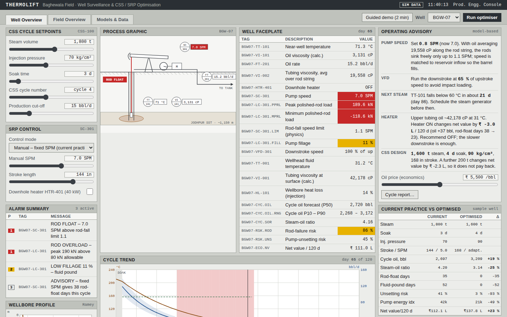
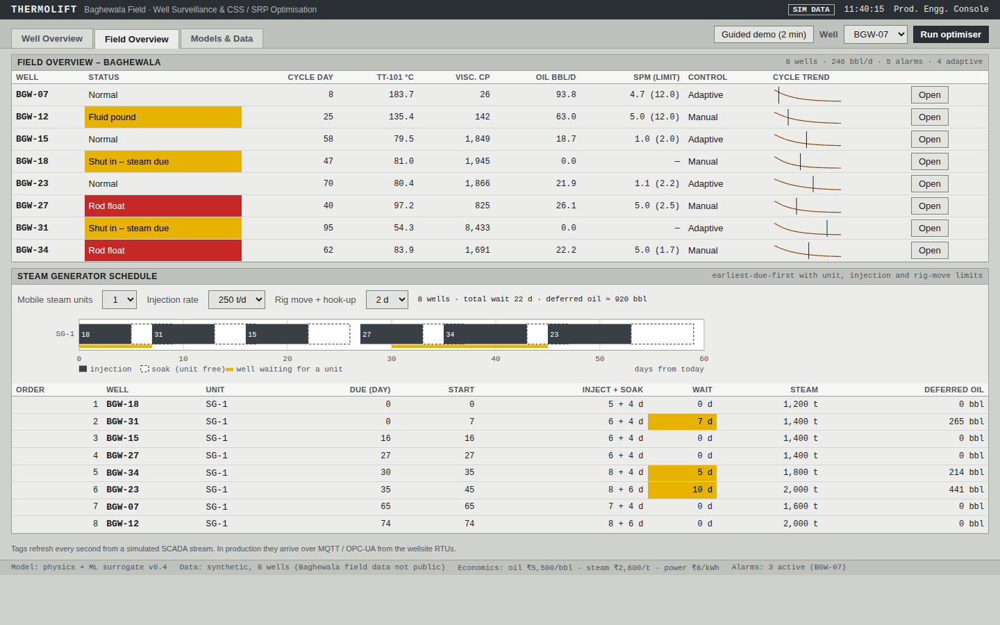
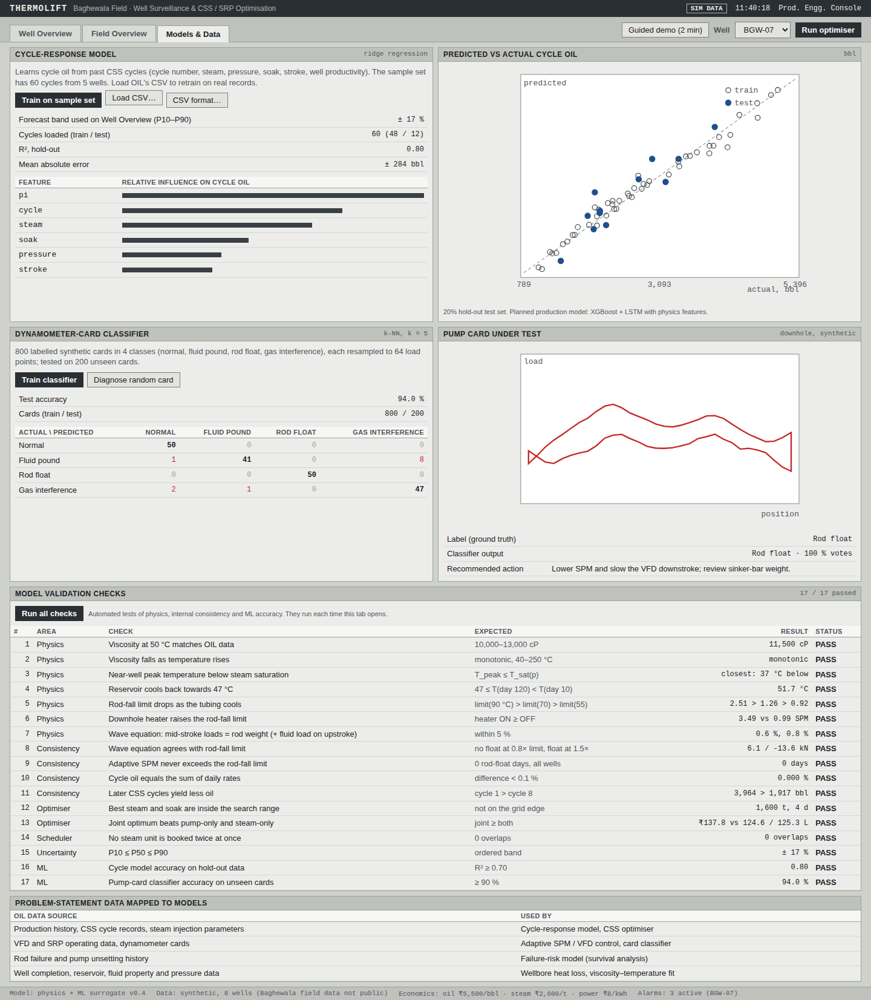
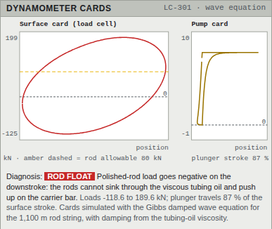

# ThermoLift: Well-to-Surface Digital Twin

**Smart India Hackathon 2026 · Problem Statement 26120 · Oil India Limited · Smart Automation (Software)**

**Live demo:** https://gauravchahal20.github.io/120-SIH/ (add `#tour` for the guided demo) · **Idea deck:** [docs/ThermoLift_SIH26120.pdf](docs/ThermoLift_SIH26120.pdf)



ThermoLift is an AI-enabled digital twin for the heavy-oil wells of Baghewala Field. It optimises **Cyclic Steam Stimulation (CSS)** and **Sucker Rod Pump (SRP)** operations together in one loop. Today these are tuned separately, from experience.

## The problem

Baghewala crude is 10,000–13,000 cP at 50 °C (Oil India). After steam injection the reservoir cools back towards 46–48 °C, and the viscosity rises about 1000× from its hot value. Meanwhile the pump keeps running at a fixed, manually set SPM, which leads to:

- rod float and impact loading
- fluid pound and pump unsetting
- rod failures
- a high steam-oil ratio (SOR) and wasted energy

## What the prototype does

| Module | What it shows |
|---|---|
| **Well Overview** | ISA-101 style operator screen: tagged well faceplate, alarm summary, P&ID process graphic, and a day-by-day cycle trend of a CSS cycle: near-well temperature, viscosity (Andrade model), oil rate, SPM and rod-float risk zones |
| **Wellbore profile** | Ramey-type temperature profile up the 1,150 m tubing: wellhead temperature and upper-tubing viscosity, with a downhole-heater advisory when the oil gets too thick |
| **Process graphic** | Animated pumping unit, rod string and heated reservoir zone, with instrument tags (TT-101, FT-201, SC-301) linked to live model values |
| **CSS optimiser** | Searches steam volume, injection pressure, soak time and stroke length to maximise net value per 120 days; later CSS cycles yield less oil (cycle-number decline) |
| **Adaptive SRP control** | Physics-based rod-fall limit: buoyant rod-string weight against the viscous drag of the oil in the tubing (7/8 in rods in 2-7/8 in tubing, temperature profile from the wellbore model). Sets SPM, stroke and a slower VFD downstroke; optional 40 kW downhole heater with its power cost |
| **Forecast uncertainty** | Oil-rate and cycle-oil P10–P90 band (about ±17 %) derived from the cycle model's hold-out error |
| **Operating advisory** | Model-based advice with the reason for each setpoint, plus an oil-price sensitivity slider |
| **Dynamometer cards** | Surface card (load cell) and downhole pump card simulated with the **Gibbs damped wave equation** for the 1,100 m rod string, with damping from the tubing-oil viscosity; shows rod float (negative load), rod overload against the allowable and plunger-stroke loss, with automatic diagnosis |
| **Field Overview** | Live status grid for 8 wells with sparklines, plus a steam-unit scheduler (earliest-due-first with unit count, injection rate and rig-move time) showing waiting days and deferred oil on a Gantt chart |
| **Models & Data** | Cycle-response model (ridge regression, R² ≈ 0.80 on hold-out data), a CSV upload to retrain it on real data, and a 4-class dyno-card classifier (≈ 94% test accuracy) |
| **Cycle report** | A one-click recommendation report for field engineers |
| **Model validation** | 17 automated checks (physics, consistency, optimiser, scheduler, ML) run in the app: 17/17 pass |
| **Guided demo** | 8-step walkthrough for first-time viewers; opens automatically when the link ends in `#tour` |

## Screenshots

| Field Overview with steam-unit schedule | Models & Data |
|---|---|
|  |  |



## Run it

Open `index.html` in Chrome or Edge, or serve the folder with any static server (`python -m http.server`). No install or build step is needed; fonts fall back to system fonts offline.

Add `#tour` to the link to start the guided demo automatically.

To publish it: repository **Settings → Pages → Deploy from branch → main / root**. The demo is then live at `https://<username>.github.io/<repo-name>/`.

**Demo flow:**

0. Click **Guided demo (2 min)** for an automatic walkthrough, or follow these steps:
1. **Well Overview**, manual SPM mode: set Manual SPM to 7, press **Play**, and watch the rod-float band and the priority-1 alarm appear as the well cools.
2. Click **Run optimiser** and read the comparison table and operating advisory.
3. Open **Field Overview** and change the number of mobile steam units from 2 to 1 to see waiting days and deferred oil.
4. Open **Models & Data**, click **Train on sample set**, then **Diagnose random card**.

## Repository structure

```
.
├── index.html            # page layout
├── css/
│   └── style.css         # ISA-101 style operator console
├── js/
│   ├── physics.js        # viscosity, wellbore heat loss, rod-fall limit, Gibbs wave equation
│   ├── simulation.js     # CSS cycle simulation and the optimiser
│   ├── app.js            # shared UI state and helpers
│   ├── well-view.js      # Well Overview screen
│   ├── field.js          # Field Overview and steam-unit scheduler
│   ├── models.js         # ML models and the validation checks
│   └── tour.js           # guided demo
├── data/
│   └── sample_css_cycles.csv
├── docs/
│   ├── ThermoLift_SIH26120.pdf
│   └── Demo_Video_Script.md
└── screenshots/
```

No build step and no dependencies: plain HTML, CSS and JavaScript.

## Data format

`data/sample_css_cycles.csv` has one row per CSS cycle: `well, cycle, steam (t), pressure (kg/cm²), soak (d), stroke (in), pi (productivity index), cycle_oil (bbl)`. Replace the rows with real cycle records and load the file in **Models & Data → Load CSV** to retrain the cycle-response model.

## Architecture (production plan)

```
OIL data (SCADA/VFD, CSS records, failure logs, PVT)
      → Python ETL + TimescaleDB (MQTT / OPC-UA from wellsite RTUs)
      → Digital twin = physics (Marx–Langenheim heating, Ramey wellbore heat loss, Andrade μ(T), calibrated to OIL's published viscosity)
                       + ML (XGBoost cycle response, LSTM rate forecast, CNN dyno-card classifier, survival model for rod failure)
      → Bayesian optimiser with rod-load / SPM safety limits
      → Engineer approves → VFD setpoints → each completed cycle retrains the model
```

Planned stack: React + D3 dashboard, FastAPI backend, on-premise deployment at OIL with an edge gateway at each wellsite.

## Honest scope

- All wells, cycles and dynamometer cards in this prototype are **synthetic**, because Baghewala field data is not public.
- The reported gains are simulation outputs, not field results. Examples on the cycle-4 sample well: +19% cycle oil, −25% SOR, 0 rod-float and 0 fluid-pound days, −49% pump energy. Optimising steam and pump together (+19%) beats pump-only (+7%) and steam-only (+4%).
- The production version would calibrate every model on Oil India's historical data.

## References

- Butler, R. M. (1991). *Thermal Recovery of Oil and Bitumen*. Prentice Hall.
- Marx, J. W. & Langenheim, R. H. (1959). Reservoir heating by hot fluid injection. *Trans. AIME*, 216.
- Ramey, H. J. (1962). Wellbore heat transmission. *Journal of Petroleum Technology*, 14(4).
- Gibbs, S. G. (2012). *Rod Pumping: Modern Methods of Design, Diagnosis and Surveillance*.

## Team

`<HELLO WORLD>` · `<188491>` · `<Chandigarh College of Engineering and Technology>`
